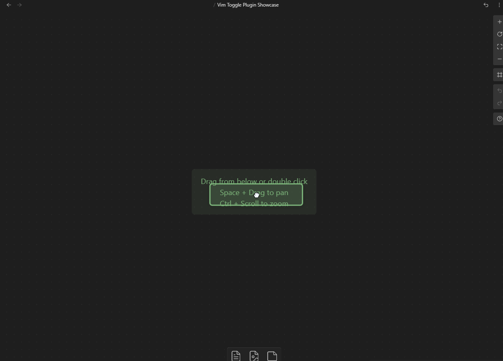

# Vim Toggle Plugin Obsidian
made with 🤍 by Conner Ohnesorge
>> Toggle the state of Vim inside of Obsidian, in response to Obsidian Canvas Core Plugin Functionality.

The new Canvas Plugin has prompted me to make a small plugin to toggle the state of use of the vim editor in obsidian.
# Wondering what vi/vim is?

[    ### Vim in 100 Seconds - YouTube  https://www.youtube.com › watch  ](https://www.google.com/url?sa=t&rct=j&q=&esrc=s&source=web&cd=&ved=2ahUKEwjM4-3Es6v8AhW1KX0KHYH4Bs8QtwJ6BAgOEAI&url=https%3A%2F%2Fwww.youtube.com%2Fwatch%3Fv%3D-txKSRn0qeA&usg=AOvVaw0opUAcd4wCUwrJmBWm0zox) 

[    ### Understanding Vi and Vim (Vi IMproved) in 10 Minutes  https://www.youtube.com › watch  ](https://www.google.com/url?sa=t&rct=j&q=&esrc=s&source=web&cd=&ved=2ahUKEwjM4-3Es6v8AhW1KX0KHYH4Bs8QtwJ6BAgQEAI&url=https%3A%2F%2Fwww.youtube.com%2Fwatch%3Fv%3Dnbph7RYWhwM&usg=AOvVaw0WsJDH24HqQHumDJS09xYX) 

# The Basics
This plugin is a simple plugin that allows for the toggling of vim mode in Obsidian with a command configurable to a hotkey. You can also turn off or on notifications for the plugin.  That pretty much it for basic functionality.

> [!important]+ Main Offerings
>- Toggle Vim mode
>- Optional Notification when toggling
>- Community Avaliability
# Usage
Usage for this plugin is done through a settings tab accessible boolean variable and a command to run that toggles and untoggles vim inside of Obsidian. The command can be bound to a hotkey for quicker and more efficient use. 

To access the plugin settings, click on the settings cog in the top right corner of Obsidian or use a hotkey <kbd>Ctrl<kbd>+</kbd>,</kbd>From there, find the Vim Mode setting and toggle it to "On". This will enable Vim Toggle within the current instance of obsidian. 

## Basic Usage
Once installed, you can toggle vim mode on and off with a command. You can configure this command to a hotkey of your choice in the settings. You can also turn off or on notifications for when vim mode is turned on or off. 

### Normal installation
To install this plugin normally, you can navigate within the obsidian app to the community plugins to view and install this plugin without even exiting the app! Hopefully you can find some use for it yourself! (You will be able to do this soon).

### Manual Installation
To install this plugin manually, you'll need to download the source code from the [GitHub repository](https://github.com/nkomarn/obsidian-vim-mode) and place it in the `plugins` folder in your Obsidian data directory. Once that is done, restart Obsidian and you should be good to go. 

## Support 

If you have any questions or problems with this plugin, you can reach out through a github issue regarding issues, updates, features, and bug reports.  We also have a support page that includes information about the plugin and how to use it within the wikipedia part of github.

This project uses Typescript to provide type checking and documentation. The repo depends on the latest plugin API (obsidian.d.ts) in Typescript Definition format, which contains TSDoc comments describing what it does.

Feel free to donate to my kofi and/or share this project!

kofi: conneroisu
# Use Case
Writting inside of obsidian canvas mode can be alittle tedious using vim mode cause of the constant inserting, this plugin allows for the user to evade these difficulties by switching to regular typing from vim mode temporarily.

# Contributions
| Conner Ohnesorge |
| ---------------- |
|           |
| github username: [conneroisu](https://github.com/conneroisu) |
| email: conneroisu@outlook.com                            |

| Andrew Baxter |
| ---------------- |
| github username: [andrewbaxter439](https://github.com/andrewbaxter439) |
| email: NA |

| Matthew Turk |
| ---------------- |
| github username: [matthewturk](https://github.com/matthewturk) |
| email: matthewturk@gmail.com |
